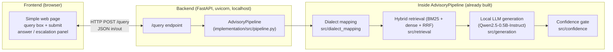
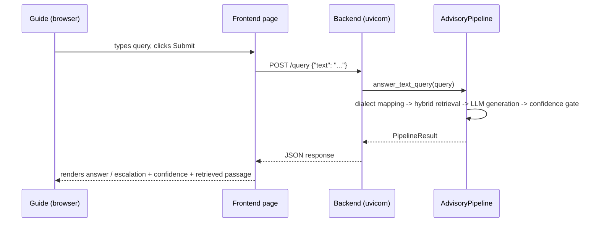

# System Architecture — Demo Setup (Frontend + Backend)

This document describes how the `implementation/` prototype (currently a
CLI-only pipeline, see `implementation/README.md`) is set up to run as a
live, demoable system: a **backend API** wrapping `AdvisoryPipeline`, and a
**frontend** that talks to it. This is the plan/setup reference to walk a
guide or reviewer through "how this actually runs," not a paper section —
paper claims still live in `paper/main.tex` and are governed by `AGENTS.md`.

**Status: built and working.** `implementation/src/server.py` (FastAPI
backend) and `frontend/index.html` (static demo page) both exist and have
been verified end to end.

## 0. Start everything with one command

```bash
./start.sh
```

Starts the backend on `:8000` (loads the KB, retrievers, and the real LLM —
takes ~15-20s), the frontend on `:5173`, waits for the backend health check,
then prints both URLs. Open `http://localhost:5173` in a browser. Ctrl+C
stops both.

## 1. The one-sentence version

A farmer's query (typed text today; audio in two other modes the pipeline
already supports) goes to a small Python backend that runs the same
`AdvisoryPipeline` used in the CLI and tests, and a browser page shows the
retrieved passage, the confidence-gate decision, and the final answer or
escalation message.

## 2. Component diagram



## 3. Backend

**Framework:** FastAPI + `uvicorn` (not yet a dependency — needs adding to
`implementation/requirements.txt`).

**What it does:** loads one `AdvisoryPipeline` instance at process startup
(the same class the CLI and `tests/test_pipeline_smoke.py` already exercise
— see `implementation/src/pipeline.py:58`), keeps it resident in memory
(avoids re-loading MiniLM/Whisper/wav2vec2/Qwen on every request, which is
where the multi-second one-time load costs in
`implementation/README.md`'s latency table come from), and exposes it over
HTTP.

**Planned endpoints:**

| Method | Path | Body | Returns |
|---|---|---|---|
| `POST` | `/query` | `{"text": "..."}` | `PipelineResult` fields as JSON: `answer`, `answer_source`, `confidence`, `escalate`, `top1_title`, `top1_score`, `normalized_query`, `matched_dialect_terms`, `timings_sec` |
| `GET` | `/health` | — | `{"status": "ok", "llm_loaded": true/false}` — useful to show the guide that generation is real LLM vs. template fallback |

`PipelineResult` (`implementation/src/pipeline.py:42`) is already a
dataclass with exactly the fields a JSON response needs — the backend is
mostly `dataclasses.asdict(pipeline.answer_text_query(query))` behind a
route, not new logic.

**Run command (once built):**
```bash
cd implementation
source .venv/bin/activate
uvicorn src.server:app --host 0.0.0.0 --port 8000
```

## 4. Frontend

**Scope for a guide demo:** a single static HTML page (no build step, no
framework needed) — a text input, a submit button, and a results panel that
renders `answer`, whether it escalated, the confidence score, and which
passage was retrieved. `fetch()` to `http://localhost:8000/query`.

This keeps the demo to two processes total (`uvicorn` + a static file
server, or even the page opened directly from disk with CORS enabled on the
backend) — no Node/React toolchain required unless a richer UI is wanted
later.

**Run command (once built):**
```bash
cd frontend
python3 -m http.server 5173     # or just open index.html directly
```

## 5. Request/response flow for one query



## 6. What exists today vs. what needs building

| Piece | Status |
|---|---|
| `AdvisoryPipeline` (all retrieval/mapping/generation/gate logic) | **Built**, tested, working — `implementation/src/pipeline.py` |
| CLI entry point | **Built** — `python -m src.pipeline "query"` |
| Backend HTTP wrapper (FastAPI app, `/query`, `/health`) | **Built** — `implementation/src/server.py` |
| Frontend page | **Built** — `frontend/index.html` |
| One-command startup (`./start.sh`) | **Built** — starts backend + frontend, waits for health check |
| Audio upload support (asr_cascade / speech_native modes) | Pipeline methods already exist (`answer_audio_query_asr_cascade`, `answer_audio_query_speech_native`); not wired to an endpoint yet — text-only is the minimal demo path |

## 7. Notes for the guide walkthrough

- Point to `implementation/README.md`'s "What's real vs. demo-scale vs.
  stubbed" table — the backend doesn't change what's real, it just makes the
  same real mechanism reachable over HTTP instead of only the CLI.
- `answer_source` in every response tells you honestly whether that specific
  answer came from the real LLM or the templated fallback — worth pointing
  out live during the demo.
- `escalate: true` responses are a feature, not a failure — show at least
  one low-confidence query alongside a confident one so the confidence gate
  (contribution 3 of the paper) is visibly doing something.
